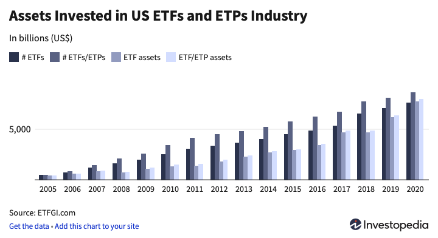
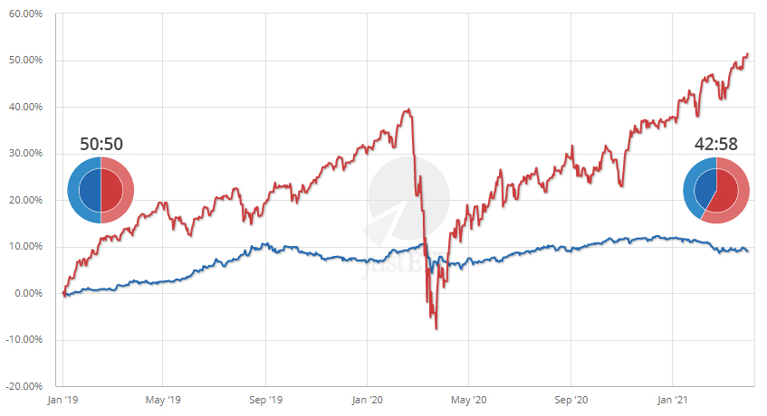
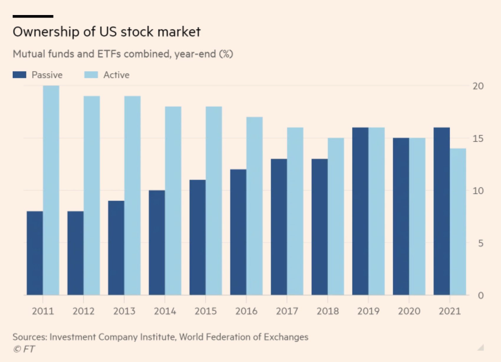
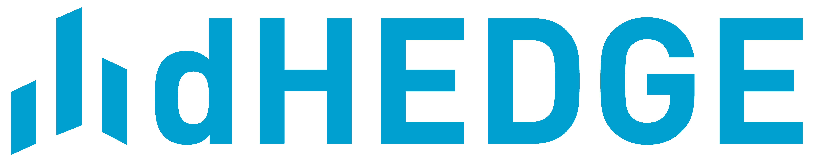
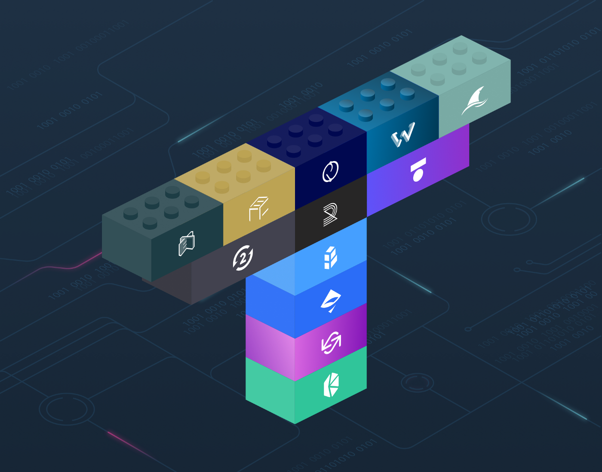

### Gestão de Ativos

##### _(Índices/Fundos)_

Pedro Brandão<br />
Co-Founder @ [DeFi Basket](https://defibasket.org)

Twitter: [@pgbrandao](https://twitter.com/pgbrandao)<br />
GitHub: [@pgbrandao](https://github.com/pgbrandao)

_LIFT Learning – set/2022_

<!--s-->

## Intro

<!--v-->


[🔗 beholdstudios.com.br](https://www.beholdstudios.com.br)

<!--v-->


[🔗 labhackercd.leg.br](https://labhackercd.leg.br)

<!--v-->


[🔗 defibasket.org](https://www.defibasket.org)

<!--s-->

## TradFi

<!--v-->

### Retorno por classe de ativo


https://novelinvestor.com/asset-class-returns/

<!--v-->

### Índices

<blockquote>
An index is a method to track the performance of a group of assets in a standardized way. Indexes typically measure the performance of a basket of securities intended to replicate a certain area of the market.
</blockquote>

[🔗 What's an Index?](https://www.investopedia.com/terms/i/index.asp)
Note:

Um índice é um a forma de acompanhar a performance de um grupo de ativos de uma forma padronizada.
Geralmente índices medem a performance de uma cesta de ativos de forma a replicar um setor do mercado.

fundos de índice acompanham a precificação definida majoritariamente pela gestão ativa
é a gestão ativa quem define os preços
os preços determinam market cap
e o market cap é seguido pelos fundos de índice

como os fundos de gestão ativa são muito mais caros,
a longo prazo os fundos de gestão passiva tendem a performar melhor por serem muito mais baratos

<!--v-->

### S&P 500

[🔗 S&P methodology 🤯](https://www.spglobal.com/spdji/en/documents/methodologies/methodology-sp-us-indices.pdf)

Notes:
500 maiores empresas na NYSE e Nasdaq

Regras complexas para entrar no S&P
Exemplo
Pra entrar no índice:

- 4 trimestres com balanços positivos
- Necessita aprovação de um comitê
  Resultado: Tesla demorou 10 anos

<!--v-->

### ETFs

_Exchange Traded Funds_: fundos negociados como ações. Alguns são de gestão ativa, mas a maioria é passiva.

Baratos: fundo de gestão passiva pode custar 0,03%.

<!--v-->

### ETFs



[🔗 The Future of ETFs](https://www.investopedia.com/the-future-of-etfs-4772514)

<!--v-->

### ETFs

<blockquote style="font-size:60%">Nadig believes that <b>high-tech platforms</b> will lead to increased competition among asset management firms and <b>redefine the way investors think about their overall portfolios</b>. “I think that these alternative platforms, whether you call them direct indexing or not, are the future of consolidated investment management”.</blockquote>

[🔗 The Future of ETFs](https://www.investopedia.com/the-future-of-etfs-4772514)

<!-- ### Title -->

<!-- - História dos ETFs no mercado tradicional -->

<!-- - Gestão ativa vs gestão passiva
- Rebalanceamento
- Crescimento dos ETFs
- Algo que mostre que é difícil beat the market??
- Taxa de administração/performance
- ETFs vs fundos tradicionais -->

<!-- Note:

- ETFs → são produtos estruturados? -->

<!--v-->

### Rebalanceamento



[🔗 justetf.com](https://www.justetf.com/en/academy/what-is-portfolio-rebalancing.html)

<!--v-->

### Gestão ativa vs passiva



[🔗 Passive fund ownership of US stocks overtakes active for first time](https://www.ft.com/content/27b5e047-5080-4ebb-b02a-0bf4a3b9bc08)

Note: Gestão passiva == "melhor"?

<!--s-->

## E em DeFI?

<!--v-->

### DeFi Pulse Index


[🔗 indexcoop.com](https://indexcoop.com/defi-pulse-index-dpi)

<!--v-->

### TokenSets


[🔗 tokensets.com](https://www.tokensets.com)

<!--v-->



[🔗 dHedge](https://app.dhedge.org/)

<!--v-->

### Balancer


<p class="fragment">AMMs são ≈ fundos de investimento?</p>

<a href="https://app.balancer.fi/#/pool/0xa33e376932b2c01323f0a7f9bbe0a53f7662b2e900010000000000000000031d" class="fragment">🔗 app.balancer.fi</a>

<ul>
<li class="fragment">Fee</li>
<li class="fragment">Liquidez</li>
<li class="fragment">Alocação: valor % fixo</li>
<li class="fragment">❗️ Impermanent loss</li>
</ul>

<!--v-->

### Defi Llama


[🔗 defillama.com](https://defillama.com/protocols/Indexes)

<!--s-->

### DeFi Basket

<!--v-->

- Batch de transações para criar um portfolio
- Ativos 100% _non-custodial_

[🔗 defibasket.org](https://defibasket.org/)

<!--v-->

### Integrações possíveis

- Tokens ERC-20 (_buy and hold_)
- Fornecer liquidez em LPs / staking
- Lending
- ...

<!--v-->


[🔗 docs.defibasket.org](https://docs.defibasket.org/)

<!--s-->

## Hands-on ✍️



<!--v-->

Extensões no VSCode:

- [Prettier](https://marketplace.visualstudio.com/items?itemName=esbenp.prettier-vscode)
- [JuanBlanco.solidity](https://marketplace.visualstudio.com/items?itemName=JuanBlanco.solidity)
- [Hardhat](https://marketplace.visualstudio.com/items?itemName=NomicFoundation.hardhat-solidity)

<!--v-->

```bash
npm install hardhat
npx hardhat
```

<!--v-->

```
contract LiftInvest {
  constructor(
    uint256[] memory _allocation,
    address[] memory _tokens,
    address[][] memory _paths
  );
  function deposit payable();
  function withdraw(
    uint256 _sell_pct
  );
}
```

<!--v-->

### Quickswap

[🔗](https://docs.quickswap.exchange/reference/smart-contracts/router02)

<!--v-->

##### Descobrindo o path no Quickswap

```bash
npm install ethers
node
```

```node
const ethers = await require("ethers");
const data = "0x..."; // tx data from metamask
ethers.utils.defaultAbiCoder.decode(
  ["uint256", "address[]", "address", "uint256"],
  ethers.utils.hexDataSlice(data, 4)
);
```

<!--v-->

##### Deploy no Tenderly

[🔗 tenderly.co](https://tenderly.co/transaction-simulator)

<!--v-->

### What next?

- Implementar tokens ERC-20 que representem a alocação (substituindo o `mapping`)
- Adicionar `require`s
- Permitir `paths` dinâmicos (otimização das rotas)
- Integração com um protocolo de lending (como a Aave)

<!--s-->

##### EIP-4987: Held token standard

[🔗 eips.ethereum.org](https://eips.ethereum.org/EIPS/eip-4987)

[🔗 ethereum-magicians.org](https://ethereum-magicians.org/t/eip-4987-held-token-standard-nfts-defi/7117/8)

<!--s-->

### Repositório da aula

[🔗 https://github.com/pgbrandao/lift-defi-aula11](https://github.com/pgbrandao/lift-defi-aula11)

<!-- ## Extra -->

<!-- ### Lending

- Pq lending?
- Lending off-chain vs on-chain
- Atores
  - Lender
  - Borrower
  - Liquidador
  - Oracle -->
