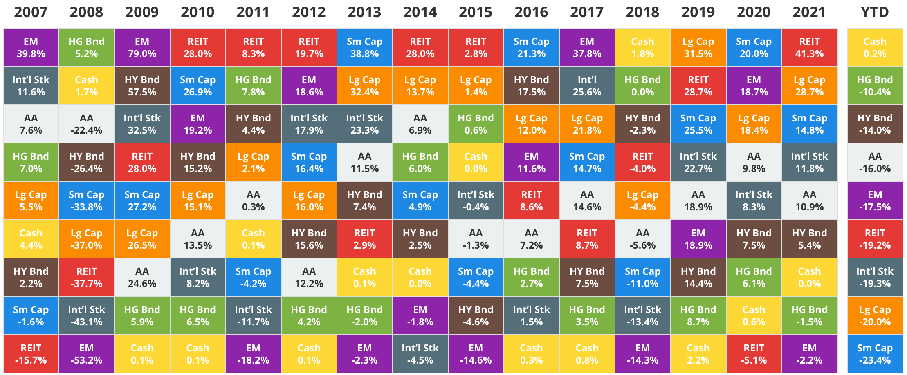
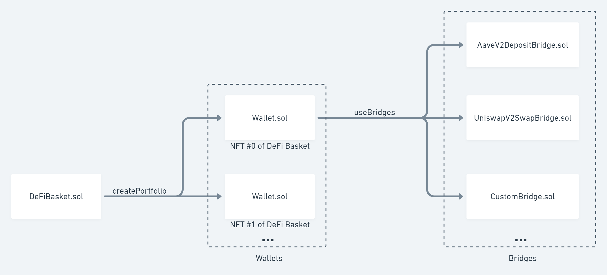

<!-- ### Asset management em DeFi -->
<!-- ### Gestão de ativos em DeFi -->
<!-- ### Gestão de portfólios em DeFi -->

### Índices em DeFi

Pedro Brandão<br />
Co-Founder @ [DeFi Basket](https://defibasket.org)

Twitter: [@pgbrandao](https://twitter.com/pgbrandao)<br />
GitHub: [@pgbrandao](https://github.com/pgbrandao)

_LIFT Learning – set/2022_

<!--s-->

### Conceitos de TradFi

- Indexação
- Fundos de índice
- ETFs
- Gestão ativa vs gestão passiva

Note:
fundos de índice acompanham a precificação definida majoritariamente pela gestão ativa
é a gestão ativa quem define os preços
os preços determinam market cap
e o market cap é seguido pelos fundos de índice

como os fundos de gestão ativa são muito mais caros,
a longo prazo os fundos de gestão passiva tendem a performar melhor por serem muito mais baratos

<!--s-->

### Retorno por classe de ativo



https://novelinvestor.com/asset-class-returns/

<!-- ### Title -->

<!-- - História dos ETFs no mercado tradicional -->

<!-- - Gestão ativa vs gestão passiva
- Rebalanceamento
- Crescimento dos ETFs
- Algo que mostre que é difícil beat the market??
- Taxa de administração/performance
- ETFs vs fundos tradicionais -->

<!-- Note:

- ETFs → são produtos estruturados? -->

<!--s-->

John Bogle

<br />


<!--s-->

### S&P 500

Notes:
500 maiores empresas na NYSE e Nasdaq

Regras complexas para entrar no S&P
Exemplo
Pra entrar no índice:

- 4 trimestres com balanços positivos
- Necessita aprovação de um comitê
  Resultado: Tesla demorou 10 anos

<!--s-->

### ETFs

_Exchange Traded Funds_: fundos negociados como ações. Alguns são de gestão ativa, mas a maioria é passiva.

Baratos: fundo de gestão passiva pode custar 0,03%.

<!--s-->

### Rebalanceamento

https://www.justetf.com/en/academy/what-is-portfolio-rebalancing.html

<!--s-->

### Uniswap

https://github.com/Uniswap/v3-core/blob/main/contracts/UniswapV3Pool.sol

### Simular transações tenderly

<!--s-->

<!-- ### DeFi Llama -->


https://defillama.com/protocols/Indexes

<!--s-->

### Lending

- Pq lending?
- Lending off-chain vs on-chain

<!--s-->

### Atores

- Lender
- Borrower
- Liquidador
- Oracle

<!--s-->

## Hands-on ✍️

```

contract LiftInvestFactory {
  function createFund(
    uint256[] allocation,
    address[] token
  );
}
```

```

contract LiftInvestFund {
  function deposit payable();
  function withdraw();
}
```

<!--s-->

### DeFi Basket

- Batch de transações para criar um portfolio
- Ativos 100% _non-custodial_

<!--v-->

### Integrações possíveis

- Tokens ERC-20 (_buy and hold_)
- Lending de tokens (_receber yield_)
- LP tokens (_fornecer liquidez_)
- ...

<!--v-->



https://docs.defibasket.org/

<!--s-->

Atualmente, não há padrão consolidado

##### EIP-4987: Held token standard

https://eips.ethereum.org/EIPS/eip-4987

https://ethereum-magicians.org/t/eip-4987-held-token-standard-nfts-defi/7117/8
